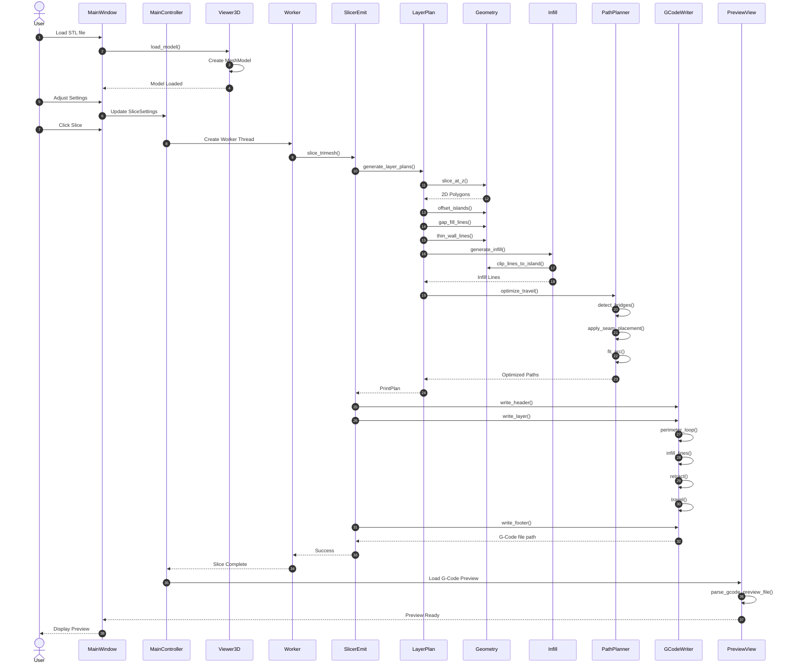

## Component Interaction Flow

```mermaid
sequenceDiagram
    autonumber
    actor User
    participant MainWindow
    participant MainController
    participant Viewer3D
    participant Worker
    participant SlicerEmit
    participant LayerPlan
    participant Geometry
    participant Infill
    participant PathPlanner
    participant GCodeWriter
    participant PreviewView

    User->>MainWindow: Load STL file
    MainWindow->>Viewer3D: load_model()
    Viewer3D->>Viewer3D: Create MeshModel
    Viewer3D-->>MainWindow: Model Loaded

    User->>MainWindow: Adjust Settings
    MainWindow->>MainController: Update SliceSettings

    User->>MainWindow: Click Slice
    MainController->>Worker: Create Worker Thread
    Worker->>SlicerEmit: slice_trimesh()

    SlicerEmit->>LayerPlan: generate_layer_plans()
    LayerPlan->>Geometry: slice_at_z()
    Geometry-->>LayerPlan: 2D Polygons

    LayerPlan->>Geometry: offset_islands()
    LayerPlan->>Geometry: gap_fill_lines()
    LayerPlan->>Geometry: thin_wall_lines()

    LayerPlan->>Infill: generate_infill()
    Infill->>Geometry: clip_lines_to_island()
    Infill-->>LayerPlan: Infill Lines

    LayerPlan->>PathPlanner: optimize_travel()
    PathPlanner->>PathPlanner: detect_bridges()
    PathPlanner->>PathPlanner: apply_seam_placement()
    PathPlanner->>PathPlanner: fit_arc()
    PathPlanner-->>LayerPlan: Optimized Paths

    LayerPlan-->>SlicerEmit: PrintPlan

    SlicerEmit->>GCodeWriter: write_header()
    SlicerEmit->>GCodeWriter: write_layer()
    GCodeWriter->>GCodeWriter: perimeter_loop()
    GCodeWriter->>GCodeWriter: infill_lines()
    GCodeWriter->>GCodeWriter: retract()
    GCodeWriter->>GCodeWriter: travel()
    SlicerEmit->>GCodeWriter: write_footer()
    GCodeWriter-->>SlicerEmit: G-Code file path

    SlicerEmit-->>Worker: Success
    Worker-->>MainController: Slice Complete
    MainController->>PreviewView: Load G-Code Preview
    PreviewView->>PreviewView: parse_gcode_preview_file()
    PreviewView-->>MainWindow: Preview Ready
    MainWindow-->>User: Display Preview
```
