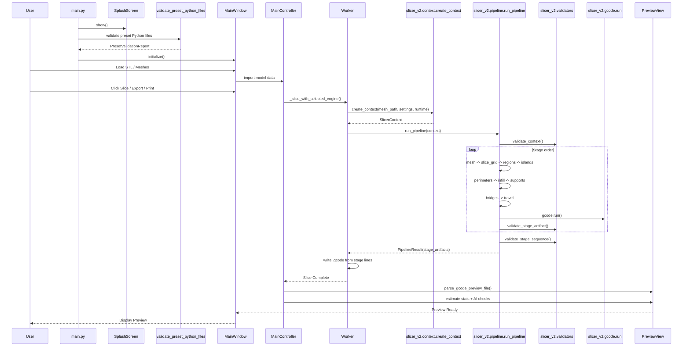

## Component Interaction Flow

```mermaid
sequenceDiagram
    participant User
    participant AppMain as main.py
    participant Splash as SplashScreen
    participant PresetCheck as validate_preset_python_files
    participant MainWindow
    participant MainController
    participant Worker
    participant V2Context as slicer_v2.context.create_context
    participant Pipeline as slicer_v2.pipeline.run_pipeline
    participant Validators as slicer_v2.validators
    participant GCodeStage as slicer_v2.gcode.run
    participant PreviewView

    AppMain->>Splash: show()
    AppMain->>PresetCheck: validate preset Python files
    PresetCheck-->>AppMain: PresetValidationReport
    AppMain->>MainWindow: initialize()

    User->>MainWindow: Load STL / Meshes
    MainWindow->>MainController: import model data

    User->>MainWindow: Click Slice / Export / Print
    MainController->>Worker: _slice_with_selected_engine()

    Worker->>V2Context: create_context(mesh_path, settings, runtime)
    V2Context-->>Worker: SlicerContext
    Worker->>Pipeline: run_pipeline(context)
    Pipeline->>Validators: validate_context()

    loop Stage order
        Pipeline->>Pipeline: mesh -> slice_grid -> regions -> islands
        Pipeline->>Pipeline: perimeters -> infill -> supports
        Pipeline->>Pipeline: bridges -> travel
        Pipeline->>GCodeStage: gcode.run()
        Pipeline->>Validators: validate_stage_artifact()
    end

    Pipeline->>Validators: validate_stage_sequence()
    Pipeline-->>Worker: PipelineResult(stage_artifacts)

    Worker->>Worker: write .gcode from stage lines
    Worker-->>MainController: Slice Complete
    MainController->>PreviewView: parse_gcode_preview_file()
    MainController->>PreviewView: estimate stats + AI checks
    PreviewView-->>MainWindow: Preview Ready
    MainWindow-->>User: Display Preview
```
