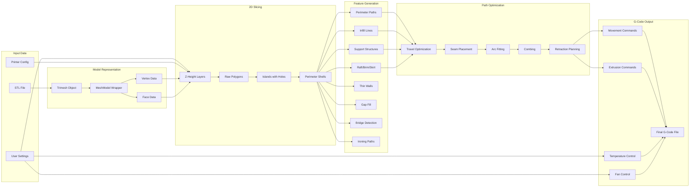

## Data Flow Architecture

```mermaid
flowchart LR
    subgraph input_data["Input Data"]
        direction TB
        A[STL File]
        B[User Settings]
        C[Printer Config]
    end

    subgraph model_representation["Model Representation"]
        direction TB
        D[Trimesh Object]
        E[MeshModel Wrapper]
        F[Vertex Data]
        G[Face Data]
    end

    subgraph slicing_2d["2D Slicing"]
        direction TB
        H[Z-Height Layers]
        I[Raw Polygons]
        J[Islands with Holes]
        K[Perimeter Shells]
    end

    subgraph feature_generation["Feature Generation"]
        direction TB
        L[Perimeter Paths]
        M[Infill Lines]
        N[Support Structures]
        O[Raft/Brim/Skirt]
        P[Thin Walls]
        Q[Gap Fill]
        R[Bridge Detection]
        S[Ironing Paths]
    end

    subgraph path_optimization["Path Optimization"]
        direction TB
        T[Travel Optimization]
        U[Seam Placement]
        V[Arc Fitting]
        W[Combing]
        X[Retraction Planning]
    end

    subgraph gcode_output["G-Code Output"]
        direction TB
        Y[Movement Commands]
        Z[Extrusion Commands]
        AA[Temperature Control]
        AB[Fan Control]
        AC[Final G-Code File]
    end

    A --> D
    D --> E
    E --> F
    E --> G
    B --> H
    C --> H
    F --> H
    G --> H
    H --> I
    I --> J
    J --> K

    K --> L
    K --> M
    K --> N
    K --> O
    K --> P
    K --> Q
    K --> R
    K --> S

    L --> T
    M --> T
    N --> T
    O --> T

    T --> U
    U --> V
    V --> W
    W --> X

    X --> Y
    X --> Z
    B --> AA
    B --> AB
    Y --> AC
    Z --> AC
    AA --> AC
    AB --> AC
```
