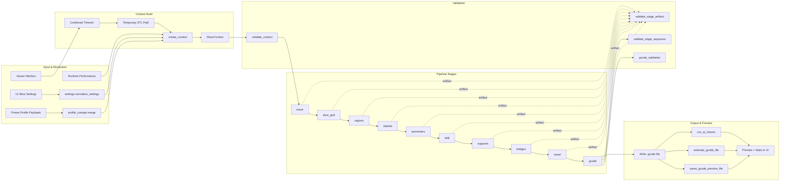

# Data Flow Architecture

```mermaid
flowchart LR
    subgraph "Input & Resolution"
        A[Viewer Meshes]
        B[UI Slice Settings]
        C[Preset Profile Payloads]
        D[Runtime Performance]
        E[settings.normalize_settings]
        F[profile_compat merge]
    end

    subgraph "Context Build"
        G[Combined Trimesh]
        H[Temporary STL Path]
        I[create_context]
        J[SlicerContext]
    end

    subgraph "Pipeline Stages"
        K[mesh]
        L[slice_grid]
        M[regions]
        N[islands]
        O[perimeters]
        P[infill]
        Q[supports]
        R[bridges]
        S[travel]
        T[gcode]
    end

    subgraph "Validation"
        U[validate_context]
        V[validate_stage_artifact]
        W[validate_stage_sequence]
        X[gcode_validation]
    end

    subgraph "Output & Preview"
        Y[Write .gcode file]
        Z[parse_gcode_preview_file]
        AA[estimate_gcode_file]
        AB[run_ai_checks]
        AC[Preview + Stats in UI]
    end

    A --> G
    G --> H
    B --> E
    C --> F
    D --> I
    E --> I
    F --> I
    H --> I
    I --> J

    J --> U
    U --> K
    K --> L --> M --> N --> O --> P --> Q --> R --> S --> T
    T --> X
    K -. artifact .-> V
    L -. artifact .-> V
    M -. artifact .-> V
    N -. artifact .-> V
    O -. artifact .-> V
    P -. artifact .-> V
    Q -. artifact .-> V
    R -. artifact .-> V
    S -. artifact .-> V
    T -. artifact .-> V
    T --> W

    T --> Y
    Y --> Z
    Y --> AA
    Y --> AB
    Z --> AC
    AA --> AC
    AB --> AC
```
