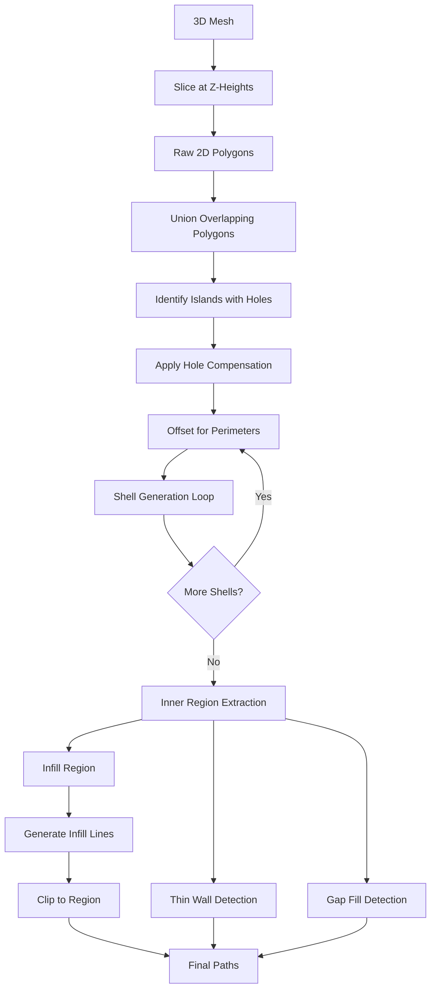
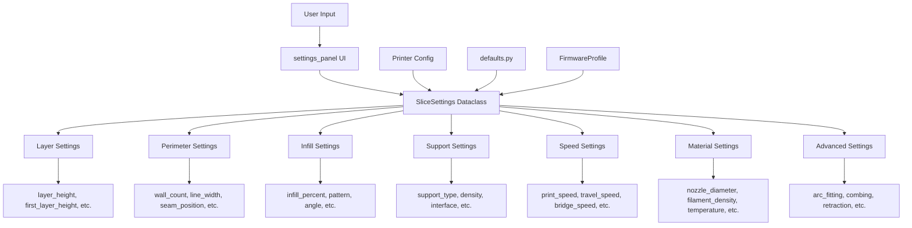

# Key Design Patterns

## 1. **Model-View-Controller (MVC) Pattern**

- **Model**: `MeshModel`, `SliceSettings`, configuration data
- **View**: All GUI components (`MainWindow`, `PrepareView`, `PreviewView`, etc.)
- **Controller**: `MainController` orchestrates interactions between views and models

## 2. **Worker Thread Pattern**

- Uses `QThreadPool` and `QRunnable` for background processing
- `Worker` class encapsulates long-running operations (slicing, file loading)
- `WorkerSignals` provide thread-safe communication back to the main thread

## 3. **Dataclass Configuration Pattern**

- `SliceSettings`, `PrintPlan`, `LayerPlan`, etc. use Python dataclasses
- Immutable configuration objects passed through the pipeline
- Type-safe settings management

## 4. **Pipeline/Chain Pattern**

- Slicing follows a clear pipeline: Mesh -> Layers -> Perimeters -> Infill -> Paths -> G-Code
- Each stage transforms data and passes to the next
- Pure functions enable easy testing and debugging

## 5. **Strategy Pattern**

- Multiple infill patterns (rectilinear, grid, triangle, honeycomb)
- Different firmware profiles (Marlin, Klipper)
- Configurable seam placement strategies
- Support structure strategies (pillar vs. tree)

## 6. **Builder Pattern**

- `GCodeWriter` builds G-Code incrementally
- `PrintPlan` constructed through multiple builder functions
- Layered construction of complex objects

## 7. **Adapter Pattern**

- `MeshModel` wraps `trimesh.Trimesh` with slicer-specific functionality
- `pyclipper` integration through geometry utility functions
- OctoPrint and Airtable adapters for external service integration

## Core Processing Flow

### Stage 1: Initialization

1. Application starts with `main.py`
2. Configuration loaded from Excel/defaults
3. Main window and views initialized
4. 3D viewer ready for model loading

### Stage 2: Model Loading

1. User loads STL file (drag-drop or file dialog)
2. `Trimesh` parses STL into vertices and faces
3. `MeshModel` wrapper provides slicing utilities
4. Model displayed in `Viewer3D` with OpenGL

### Stage 3: Pre-Slice Configuration

1. User adjusts settings in `settings_panel`
2. Settings compiled into `SliceSettings` dataclass
3. Printer configuration loaded
4. Validation of settings performed

### Stage 4: Slicing (Worker Thread)

1. **Z-Height Generation**: `build_z_heights()` creates layer heights
2. **Layer Slicing**: `slice_at_z()` intersects mesh with Z-planes
3. **Perimeter Generation**:
   - `generate_layer_perimeters()` creates shells
   - Offset operations for multiple perimeters
   - Hole compensation applied
4. **Infill Generation**:
   - Pattern generator creates fill lines
   - Lines clipped to interior regions
   - Density and angle applied
5. **Support Generation**:
   - Overhang detection
   - Tree or pillar support creation
   - Interface layers generated
6. **Special Features**:
   - Thin wall detection
   - Gap fill computation
   - Bridge detection
   - Ironing path generation
7. **Path Planning**:
   - Travel path optimization
   - Seam placement
   - Arc fitting
   - Combing within boundaries

### Stage 5: G-Code Generation

1. `GCodeWriter` initialized with settings
2. Header written (start G-Code, temperatures)
3. For each layer:
   - Write raft/brim/skirt (if applicable)
   - Write perimeters (outer -> inner or inner -> outer)
   - Write infill
   - Write support structures
   - Handle retractions and travels
4. Footer written (end G-Code, cooldown)
5. File saved to disk

### Stage 6: Preview & Output

1. G-Code parsed for preview
2. Path visualization in 3D viewer
3. Statistics computed (time, material)
4. User can send to printer or save

## Key File Responsibilities

| File/Module | Responsibility |
| --- | --- |
| `main.py` | Application entry point, initialization |
| `gui/main_window.py` | Main application window container |
| `gui/Windows/controller/*.py` | Business logic orchestration |
| `gui/viewer_3d.py` | 3D model visualization with OpenGL |
| `gui/settings_panel/` | User interface for slice settings |
| `slicer/slicer/emit.py` | Main slicing entry point |
| `slicer/slicer/plan.py` | Layer planning and perimeter generation |
| `slicer/geometry.py` | 2D geometric operations (clipper wrapper) |
| `slicer/infill.py` | Infill pattern generation |
| `slicer/support.py` | Support structure generation |
| `slicer/path_planner.py` | Path optimization and planning |
| `slicer/gcode/writer.py` | G-Code file generation |
| `slicer/mesh.py` | 3D mesh operations and slicing |
| `config/printer_config.py` | Printer configuration loading |
| `integrations/printer_manager.py` | External printer communication |

## Geometry Processing Pipeline

## Settings Hierarchy

## Summary of Architectural Strengths

1. **Clear Separation of Concerns**: GUI, slicing logic, and configuration are well separated
2. **Extensibility**: Strategy patterns make it easy to add new infill patterns, support types, etc.
3. **Type Safety**: Extensive use of dataclasses and type hints
4. **Testability**: Pure functions and clear interfaces enable unit testing
5. **Performance**: Worker threads prevent UI blocking during long operations
6. **Modularity**: Each module has a single, clear responsibility

## Areas for Potential Optimization

1. **Geometry Operations**: Heavy use of pyclipper could be optimized with caching
2. **Path Planning**: Travel optimization could use more sophisticated algorithms (TSP solvers)
3. **Memory Usage**: Large meshes could benefit from streaming/chunking
4. **Preview Generation**: Incremental preview updates during slicing
5. **Settings Validation**: More comprehensive validation before slicing starts
