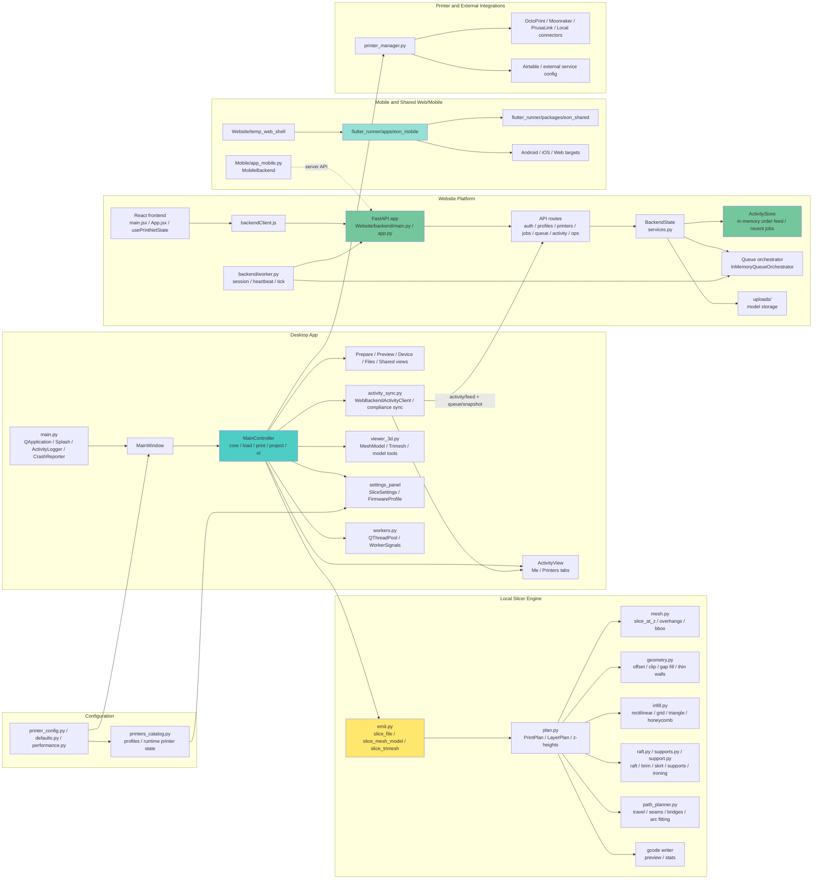

## System Architecture

```mermaid
flowchart LR
    subgraph desktop_app["Desktop App"]
        direction TB
        D0["main.py<br/>QApplication / Splash / ActivityLogger / CrashReporter"]
        D1["MainWindow"]
        D2["MainController<br/>core / load / print / project / ui"]
        D3["Prepare / Preview / Device / Files / Shared views"]
        D4["ActivityView<br/>Me / Printers tabs"]
        D5["activity_sync.py<br/>WebBackendActivityClient / compliance sync"]
        D6["viewer_3d.py<br/>MeshModel / Trimesh / model tools"]
        D7["settings_panel<br/>SliceSettings / FirmwareProfile"]
        D8["workers.py<br/>QThreadPool / WorkerSignals"]

        D0 --> D1 --> D2
        D2 --> D3
        D2 --> D4
        D2 --> D6
        D2 --> D7
        D2 --> D8
        D2 --> D5
        D5 --> D4
    end

    subgraph local_slicer["Local Slicer Engine"]
        direction TB
        S0["emit.py<br/>slice_file / slice_mesh_model / slice_trimesh"]
        S1["plan.py<br/>PrintPlan / LayerPlan / z-heights"]
        S2["mesh.py<br/>slice_at_z / overhangs / bbox"]
        S3["geometry.py<br/>offset / clip / gap fill / thin walls"]
        S4["infill.py<br/>rectilinear / grid / triangle / honeycomb"]
        S5["raft.py / supports.py / support.py<br/>raft / brim / skirt / supports / ironing"]
        S6["path_planner.py<br/>travel / seams / bridges / arc fitting"]
        S7["gcode writer<br/>preview / stats"]

        S0 --> S1
        S1 --> S2
        S1 --> S3
        S1 --> S4
        S1 --> S5
        S1 --> S6
        S1 --> S7
    end

    subgraph configuration["Configuration"]
        direction TB
        C0["printer_config.py / defaults.py / performance.py"]
        C1["printers_catalog.py<br/>profiles / runtime printer state"]

        C0 --> C1
    end

    subgraph website_platform["Website Platform"]
        direction TB
        W0["React frontend<br/>main.jsx / App.jsx / usePrintNetState"]
        W1["backendClient.js"]
        W2["FastAPI app<br/>Website/backend/main.py / app.py"]
        W3["API routes<br/>auth / profiles / printers / jobs / queue / activity / ops"]
        W4["BackendState<br/>services.py"]
        W5["ActivityStore<br/>in-memory order feed / recent jobs"]
        W6["Queue orchestrator<br/>InMemoryQueueOrchestrator"]
        W7["backend/worker.py<br/>session / heartbeat / tick"]
        W8["uploads/<br/>model storage"]

        W0 --> W1 --> W2 --> W3 --> W4
        W4 --> W5
        W4 --> W6
        W4 --> W8
        W7 --> W2
        W7 --> W6
    end

    subgraph mobile_shared["Mobile and Shared Web/Mobile"]
        direction TB
        M0["Mobile/app_mobile.py<br/>MobileBackend"]
        M1["Website/temp_web_shell"]
        M2["flutter_runner/apps/eon_mobile"]
        M3["flutter_runner/packages/eon_shared"]
        M4["Android / iOS / Web targets"]

        M1 --> M2
        M2 --> M3
        M2 --> M4
    end

    subgraph printer_integrations["Printer and External Integrations"]
        direction TB
        I0["printer_manager.py"]
        I1["OctoPrint / Moonraker / PrusaLink / Local connectors"]
        I2["Airtable / external service config"]

        I0 --> I1
        I0 --> I2
    end

    C0 --> D1
    C1 --> D7
    D2 --> S0
    D2 --> I0
    D5 -->|activity/feed + queue/snapshot| W3
    M0 -.server API.-> W2

    style D2 fill:#4ecdc4
    style S0 fill:#ffe66d
    style W2 fill:#74c69d
    style W5 fill:#74c69d
    style M2 fill:#95e1d3
```
