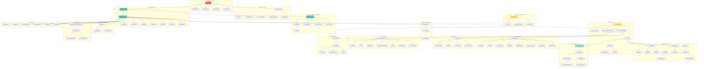

```mermaid
flowchart TB
    subgraph "Application Entry Point"
        A[main.py] --> B[QApplication]
        A --> C[SplashScreen]
        A --> D[ActivityLogger]
        A --> E[CrashReporter]
    end

    subgraph "Configuration Layer"
        F[printer_config.py]
        G[defaults.py]
        H[performance.py]
        I[printers_catalog.py]
        F --> J[Load Printer Config]
        F --> K[Airtable Config]
    end

    subgraph "Main Window & UI"
        L[MainWindow]
        M[MainController]
        N[PrepareView]
        O[PreviewView]
        P[DeviceView]
        Q[ControlView]
        R[FilesView]
        S[ActivityView]
        T[SharedView]

        L --> M
        M --> N
        M --> O
        M --> P
        M --> Q
        M --> R
        M --> S
        M --> T
    end

    subgraph "3D Viewer & Model Management"
        U[viewer_3d.py]
        V[MeshModel]
        W[Trimesh]
        AA[model_panel.py]
        AB[arrange_utils.py]
        AC[auto_orient.py]

        U --> V
        V --> W
        U --> AA
        U --> AB
        U --> AC
    end

    subgraph "Settings & Configuration"
        AD[settings_panel/]
        AE[SliceSettings]
        AF[FirmwareProfile]

        AD --> AE
        AE --> AF
    end

    subgraph "Worker Thread Management"
        AG[workers.py]
        AH[QThreadPool]
        AI[WorkerSignals]

        AG --> AH
        AG --> AI
    end

    A --> F
    A --> L
    L --> U
    M --> AG
    M --> AD

    subgraph "Slicer Core - Entry Points"
        BA[slicer/emit.py]
        BB[slice_file]
        BC[slice_mesh_model]
        BD[slice_trimesh]

        BA --> BB
        BA --> BC
        BA --> BD
    end

    subgraph "Slicer Planning"
        BE[slicer/plan.py]
        BF[PrintPlan]
        BG[LayerPlan]
        BH[LayerPerimeters]
        BI[LayerInfill]
        BJ[build_z_heights]
        BK[generate_layer_perimeters]
        BL[generate_layer_plans]

        BE --> BF
        BF --> BG
        BG --> BH
        BG --> BI
        BE --> BJ
        BE --> BK
        BE --> BL
    end

    subgraph "Support Structures"
        BM[slicer/raft.py]
        BN[slicer/supports.py]
        BO[RaftLayer]
        BP[BrimPlan]
        BQ[SkirtPlan]
        BR[BridgeInfill]
        BS[IroningPass]
        BT[support.py]
        BU[SupportPlan]
        BV[SupportColumn]
        BW[TreeSupportBranch]

        BM --> BO
        BM --> BP
        BM --> BQ
        BN --> BR
        BN --> BS
        BT --> BU
        BU --> BV
        BU --> BW
    end

    subgraph "Geometry Operations"
        CA[slicer/geometry.py]
        CB[Polygon2D]
        CC[Island2D]
        CD[LineSegment2D]
        CE[pyclipper]
        CF[offset_islands]
        CG[clip_lines_to_island]
        CH[gap_fill_lines]
        CI[thin_wall_lines]

        CA --> CB
        CA --> CC
        CA --> CD
        CA --> CE
        CA --> CF
        CA --> CG
        CA --> CH
        CA --> CI
    end

    subgraph "Infill Generation"
        CJ[slicer/infill.py]
        CK[rectilinear_infill]
        CL[grid_infill]
        CM[triangle_infill]
        CN[honeycomb_infill]

        CJ --> CK
        CJ --> CL
        CJ --> CM
        CJ --> CN
    end

    subgraph "Path Planning"
        CO[slicer/path_planner.py]
        CP[Toolpath]
        CQ[ArcFit]
        CR[BridgeRegion]
        CS[apply_seam_placement]
        CT[fit_arc]
        CU[detect_bridges]
        CV[optimize_travel]

        CO --> CP
        CO --> CQ
        CO --> CR
        CO --> CS
        CO --> CT
        CO --> CU
        CO --> CV
    end

    subgraph "G-Code Generation"
        DA[gcode/writer.py]
        DB[GCodeWriter]
        DC[gcode/preview.py]
        DD[parse_gcode_preview_file]
        DE[gcode/stats.py]
        DF[estimate_gcode_file]

        DA --> DB
        DC --> DD
        DE --> DF
    end

    M --> BD
    BD --> BL
    BL --> BF
    BF --> BM
    BF --> BN
    BF --> BT
    BL --> CA
    BL --> CJ
    BL --> CO
    BF --> DA
    DB --> DC
    DB --> DE

    subgraph "Mesh Operations"
        EA[slicer/mesh.py]
        EB[MeshModel]
        EC[slice_at_z]
        ED[overhang_triangles]
        EE[bbox]

        EA --> EB
        EB --> EC
        EB --> ED
        EB --> EE
    end

    BD --> EA
    BL --> EA

    subgraph "Integration Layer"
        FA[integrations/printer_manager.py]
        FB[PrinterManager]
        FC[OctoPrint Integration]
        FD[Airtable Integration]

        FA --> FB
        FB --> FC
        FB --> FD
    end

    M --> FA

    subgraph "GUI Utilities"
        GA[gui/popups/]
        GB[gui/widgets/]
        GC[preview_utils.py]
        GD[selection_utils.py]
        GE[theme.py]
        GF[shortcuts.py]

        M --> GA
        M --> GB
        M --> GC
        M --> GD
        M --> GE
        M --> GF
    end

    style A fill:#ff6b6b
    style L fill:#4ecdc4
    style BA fill:#ffe66d
    style BE fill:#ffe66d
    style DA fill:#95e1d3
    style U fill:#4ecdc4
    style M fill:#4ecdc4
```
