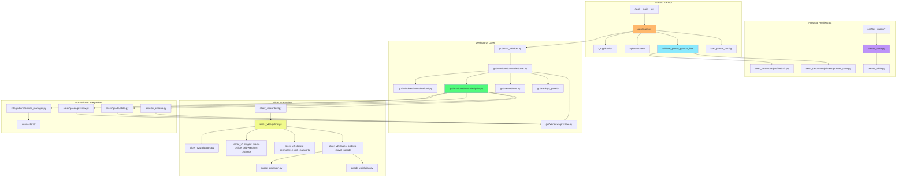

```mermaid
flowchart TB
    subgraph "Startup & Entry"
        A[App/__main__.py] --> B[App/main.py]
        B --> C[QApplication]
        B --> D[SplashScreen]
        B --> E[validate_preset_python_files]
        B --> F[load_printer_config]
    end

    subgraph "Preset & Profile Data"
        G[seed_resources/profiles/**/*.py]
        H[seed_resources/printers/printers_data.py]
        I[preset_store.py]
        J[preset_table.py]
        K[profiles_import/*]
        E --> G
        E --> H
        I --> J
        K --> I
    end

    subgraph "Desktop UI Layer"
        L[gui/main_window.py]
        M[gui/Windows/controller/core.py]
        N[gui/Windows/controller/load.py]
        O[gui/Windows/controller/print.py]
        P[gui/viewer/core.py]
        Q[gui/Windows/preview.py]
        R[gui/settings_panel/*]
        L --> M
        M --> N
        M --> O
        M --> P
        M --> Q
        M --> R
    end

    subgraph "Slicer v2 Runtime"
        S[slicer_v2/context.py]
        T[slicer_v2/pipeline.py]
        U[slicer_v2/validators.py]
        V[slicer_v2 stages: mesh->slice_grid->regions->islands]
        W[slicer_v2 stages: perimeters->infill->supports]
        X[slicer_v2 stages: bridges->travel->gcode]
        Y[gcode_emission.py]
        Z[gcode_validation.py]
        S --> T
        T --> U
        T --> V
        T --> W
        T --> X
        X --> Y
        X --> Z
    end

    subgraph "Post-Slice & Integrations"
        AA[slicer/gcode/preview.py]
        AB[slicer/gcode/stats.py]
        AC[slicer/ai_checks.py]
        AD[integrations/printer_manager.py]
        AE[connectors/*]
        AA --> Q
        AB --> Q
        AC --> Q
        AD --> AE
    end

    B --> L
    O --> S
    O --> AA
    O --> AB
    O --> AC
    O --> AD

    style B fill:#ffb86c
    style E fill:#8be9fd
    style O fill:#50fa7b
    style T fill:#f1fa8c
    style I fill:#bd93f9
```
